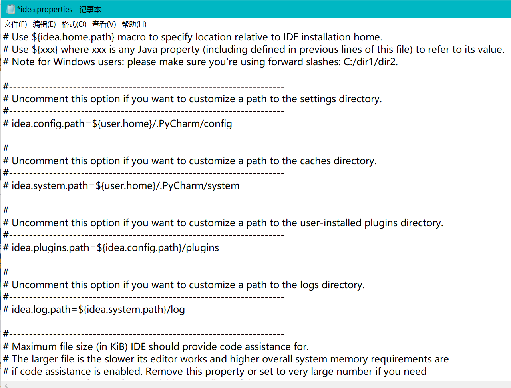
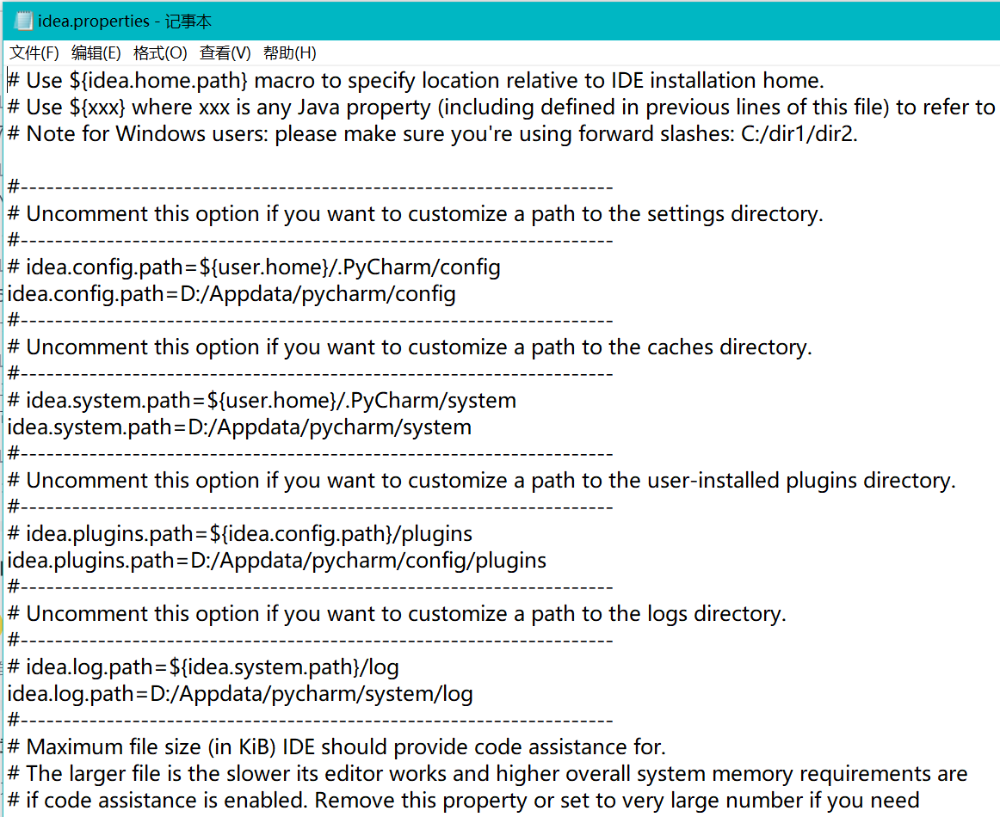

## 如何修改pycharm中的缓存地址

此处参考：

> https://blog.csdn.net/weixin_43815222/article/details/115918590
>
> https://blog.csdn.net/weixin_61959079/article/details/131689026

首先需要找到pycharm安装目录下的配置文件：idea.properties

本人的pycharm的安装目录为：D:\software\pycharm\PyCharm 2022.1.4

idea.properties位于：D:\software\pycharm\PyCharm 2022.1.4\bin

用记事本打开之后，会出现四个路径：

分别是config，system，plugin和log，其中要知道

config目录是个性化化配置目录，或者说是整个 IDE 设置目录。安装新版本的 IntelliJ IDEA 会自动扫描硬盘上的旧配置目录。这个目录主要记录了：IDE 主要配置功能、自定义的代码模板、自定义的文件模板、自定义的快捷键、Project 的 tasks 记录等等个性化的设置。

默认的config目录为：C:\Users\13155\AppData\Roaming\JetBrains\PyCharm2022.1

system目录是系统文件目录，是与开发项目一个桥梁目录，里面主要有：缓存、索引、容器文件输出等等，虽然不是最重要目录，但是也是最不可或缺目录之一

默认的system目录为：C:\Users\13155\AppData\Local\JetBrains\PyCharm2022.1

其中plugin在config中，log在system中，**需要区分！因为system中也有一个plugins的文件夹。**

我们在上图中的四个空行分别写四个修改后的地址：

我们在我们所需要的地址上将原来的system和config中的文件全部复制粘贴过去即可！

需要注意的是，如果是idea，我们还要将idea.plugins.path 和 idea.log.path 的注释去掉，不然会报设置idea.plugins.path的错误(警告)

重启IDE就好。
