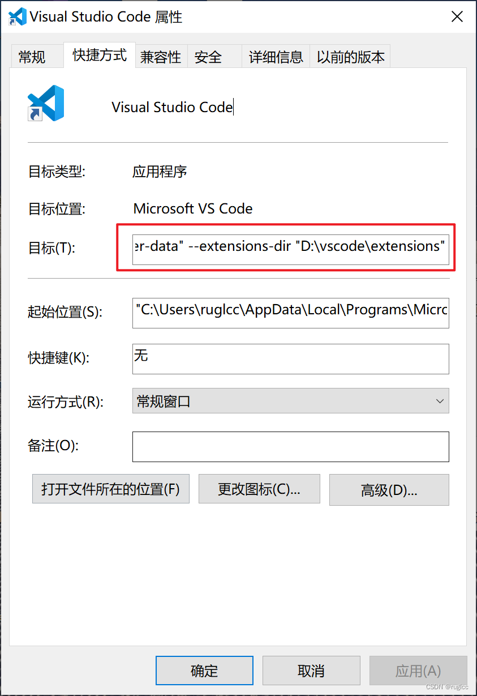

## 如何修改vscode的缓存和扩展程序的位置

默认缓存目录 ：`C:\Users\youname\AppData\Roaming\Code`
默认插件目录 : `C:\Users\youname\.vscode\extensions`

以修改为`D:\Appdata\vscode` 目录为例, 先把以前的缓存目录、已经安装的插件内容复制到 `D:\Appdata\vscode` 下

##### 1.修改快捷方式

右键->属性->快捷方式 在目录的内容后 添加 `--user-data-dir "D:\Appdata\vscode\Code" --extensions-dir "D:\Appdata\vscode\extensions"`

##### 2.修改注册表

总共3处：

* `HKEY_CLASSES_ROOT\Directory\Background\shell\VSCode\command`默认键值 `"%V"` 后添加 `--user-data-dir "D:\Appdata\vscode\Code" --extensions-dir "D:\Appdata\vscode\extensions`

* `计算机\HKEY_CLASSES_ROOT\Directory\shell\VSCode\command`和上面的方式相同

* `计算机\HKEY_CLASSES_ROOT\*\shell\VSCode\command`，在`"%1"`之后添加`--user-data-dir "D:\Appdata\vscode\Code" --extensions-dir "D:\Appdata\vscode\extensions`即可

参考：

> https://zhuanlan.zhihu.com/p/469586657
>
> https://blog.csdn.net/ruglcc/article/details/126260581