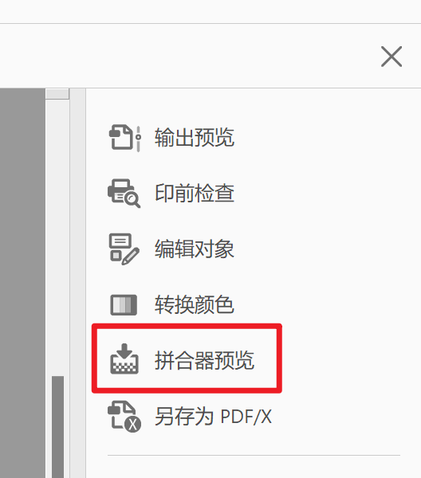
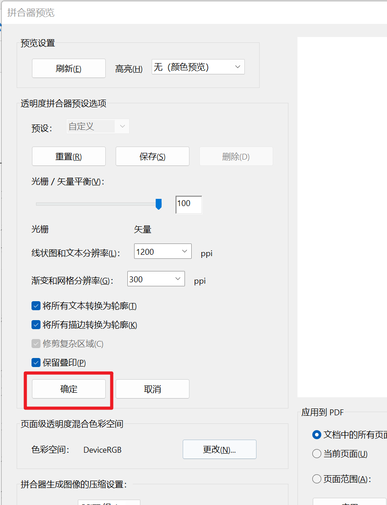

## 如何将pdf变成无法选择文字的pdf

有时候做实验报告的时候不希望老师能够直接将文档拿去查重，所以希望可以将pdf中的文字都导出成不可选择的，也可以理解为图片导出的pdf。

这里我们需要用到：Adobe Acrobat DC

加水印

然后点击水印-添加

只需填写一个全透明的字符就可以：

文本填入随便的一个字符，然后将不透明度拉到0%

在工具栏中找到使用**拼合器预览**操作：

需要选中将1、**所有文本转换为轮廓**，2、**将所有描边转换为轮廓**，3、**以及文档中的所有页面**。最后点击应用。

拼合完成之后，点击确定。

保存就好了。